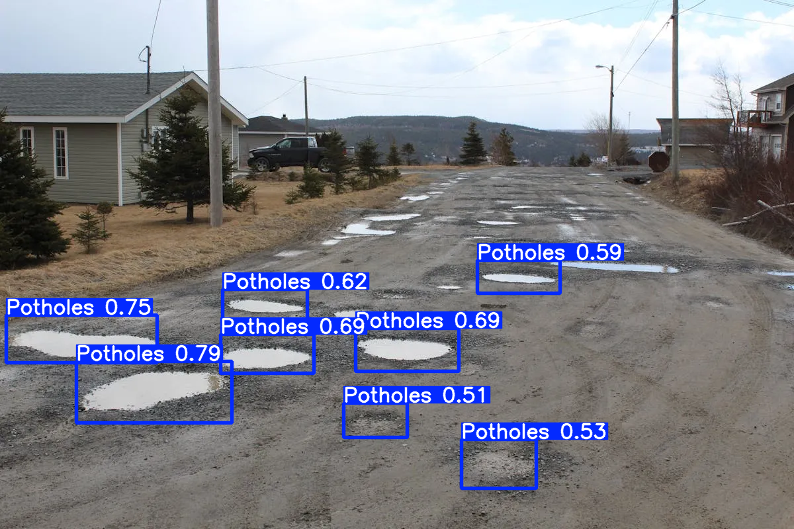

## tl;dr
- Data strategy **_is_** product strategy; especially in ML!
- Getting started with ML is more accessible than you think (thanks in large part to [this template](https://github.com/mfranzon/yolo-training-template)).
- Define the usecase first. Not starting with a clear end-goal leads to drift.
- ML is a mature field with a lot of learning and experimentation resources to lean on. 

## Where do we begin?

Last week I came across a post by [mfranzon](https://github.com/mfranzon) about training a computer vision ML model on a laptop with just a few lines of Python. 

I’ve done a lot of experimenting with foundational models but hadn’t yet experimented with model training much. This seemed like a low-friction opportunity to go ‘up the stack’ and get some hands-on experience to develop better intuition on the topic.

_This post was written in an effort to be more intentional about documenting and sharing my experimentation. I haven’t done one of these in years so I’ll be shaking off some of the rust; bear with me._

## YOLO Training Template

Mfranzon was generous enough to post his [training template here](https://github.com/mfranzon/yolo-training-template). The [readme](https://github.com/mfranzon/yolo-training-template/blob/main/README.md) says it contains 
>a template for training YOLO models on any Kaggle dataset... 

I'm still new to this so I started with some definitions:

- **You-Only-Look-Once (YOLO)** refers to an object detection algorithm that “looks” at an image only once to find both bounding boxes and probabilities simultaneously ([this blog](https://www.v7labs.com/blog/yolo-object-detection) from v7 was helpful).
- **Kaggle dataset** just refers to any one of the many datasets hosted on the Kaggle platform. Kaggle is great resources for learning about ML. 

Ok so now I have a good-enough understanding of **_what_** mfranzon is trying to help me achieve. The next step is to understand **_how_**.

## Getting started
The readme describes a couple of python scripts for running training and inference locally, but it also pulls it all into a Jupyter notebook which I know can run on Google Colab. Back to some definitions.

- **Training** refers to the actual training of the learning model. The act of giving it a bunch of labeled images to ‘learn’ from and validating its performance.
- **Inferencing** refers to running the trained model across an unlabeled image (or video in my case) and getting back a labeled image. Essentially asking the model to identify where on the image the objects of interest exists. 
- [**Jupyter Notebook**](https://jupyter.org/) is an interactive local dev environment that lets you build and run code in different ‘steps’ and see the results in-line. Its a great learning tool.
- [**Google Colab**](https://colab.research.google.com/) is a _web-based_ dev environment where you can run Jupyter notebooks and avoid any local setup. Plus you get to plug into google’s compute resources for free (!).

I decided to run the Jupyter notebook in Colab for a few reasons:
1. I wanted to avoid setup issues. Running locally  sometimes means troubleshooting dependencies. I wanted to hit the ground running, not spend an hour chasing down some mis-matched python version.
2. I’m  impatient. Training a model on your laptop sounds very cool, but the reality is that its pretty slow. I wanted to iterate and experiment quickly; waiting 1-4hrs to train locally would’ve killed my momentum. Colab give me access to high performance GPUs that will cut training down to minutes.

Enough semantics. At this stage I have a path forward on the **_how_**. Now lets get started.

## What is this thing?
First things first, I cloned the repo and opened the notebook in Colab. With the notebook open I readthrough each cell to get a better understanding of what the scripts are doing and how they relate to eachother:

- Cells 1 & 2 install and import dependencies to the dev environment.
- Cell 3 defines the functions to train the model. Generally:
  - Download the dataset from Kaggle.
  - Structure the dataset images and labels in a way that works with the training library.
  - Run the actual training by calling the training library and passing in the training data (along with some other parameters).
- Cell 4 is all about inference. It defines functions that run inference on either an image, video or web-cam using the trained model.
- Cell 5 defines parameters that are sent to the training functions. We’ll need to update these before we  run the training.
- Cells 6 is where we actually call the functions in Cell 3, and pass the values from Cell 5 to run the training. 
- Cell 7 defines parameters that are sent to the  inference functions. We’ll have to update these before running inference.
- Cell 8 is where we run inference by calling the functions in Cell 4 & passing the values from Cell 7. 

Now I've got a baseline understanding of how this notebook gets me from 0-to-trained model. Its time to pick the dataset and see what’s next.

## Picking a dataset
The yolo-training-template repo has a few example datasets that are well-suited for training. 

I think this template could work with _any_ dataset that conforms to one of the structures defined in Cell 3’s `detect_dataset_structure()`. But after a quick look at the options on Kaggle its clear that not all datasets are created equally. 

I’m here to run training and inference, not troubleshoot dataset structures, so I'll stick with one of theexample datasets from `example_datasets.md` and keep it moving. 

I chose pothole detection dataset for a few reasons:
- Its been done. The author of the template repo himself trained on this dataset. There are also many example of models that do the same. This means I’ll have a lot of resources to pull from when I surely run into trouble.
- Theres a bunch of pothole datasets on Kaggle, so I'll be able to add to the training set down the line if I want.
- There’s only 1 class, which means the model should train pretty quickly.

There are a few downsides that I also considered:
- Its been done before. I won't get to claim I made something novel. I think that's ok - I'm just getting my feet wet.
- There’s only 1 class, which isn’t very rich or exciting, but its clear and obvious. The model will either identify the object or not. 

At this point I have my ducks in a row I'm ready to start training. I updated the `dataset_handle` parameter in cell 5 to reference the pothole detection handle and clicked 'run' on Cells 1-6. 

The training begins and now it's a waiting game...

## Training Run #1: Everythings a pothole
Training run #1 was pretty quick coming in at around ~5 min (thanks Google). I chose to only run training for 1 Epoch. My hope was that this would be fast and good-enough to start inferencing on videos from outside the training set.

I uploaded a stock video showing roads with potholes to my colab environment and got ready to run inference on it. This process was also really easy thanks to the scripts in the template. All I had to do was:
- Upload the videos to colab
- Copy the file path & paste it as the `input_source` in Cell 7
- Set the save-to location as the `output_path`
- Click 'run' on Cell 8 & wait. 

_Note on saving the output. Saving to Colab is easy, but files take long to download. I ended up mounting my gdrive and using that as my save-to location._

So how did my freshly trained model do? I'd call it... _enthusiastic_. Everythings a pothole! Grass? Pothole. Motorcycle? Pothole. Fun to watch, but not quite the results I was going for. 

So what went wrong? My first guess was that the model hadn't seen enough training data, or gone through enough rounds of training, to get good at detecting potholes. 

This is called 'underfitting' and its a common problem that occurs when the model just hasn't learned enough. There's only one way to fix a model that's underfitting. More training, which in my case means more epochs. 

## Prepping for another training run
Alright, so the 1 epoch run is underfitting. Not a big surprise since it only took a few moments to run. There's parameters in Cell 5 of the jupyter notebook that let me set how many epochs I want to complete on my next training run. 

Before doing that, I want to make sure I'm _updating_ the training on my 1-epoch model, instead of starting over. For this example this isn't really a major concern, but as a matter of principle I wanted to ensure I was adding to the already-trained model, not starting from scratch. 

After a quick review of `train_model()` I see that the solve is pretty simple. Just update the value of `model` to reference our newly created model. That way training begins from the 1-epoch model, not the empty model. 
 
When the training re-runs, it will over-write the 1-epoch model with the newly updated one unless you replace `model_path` with a different location/name.

## Training Run #2: Nothings a pothole
I set `epochs = 20`, hit 'run', and waited. After ~20 min the training is complete and we can check the results.

As the training progresses we see the results of each epoch on the console. Each epoch includes scores to help assess if the model is getting any better. Since I'm just experimenting I focused on `box_loss` and `mAP50`:
- **Box Loss (box_loss)** refers to how accurately the model can determine the size and position of a pothole. The lower this score, the better the model is performing. 
- **Mean Average Precision @ 50% overlap (mAP50)** looks at how often the model drew a square that overlapped at least 50% with the validation data. The higher this score, the better the model is performing. 

With the training complete I thought it might be interesting to plot the loss and precision on a graph. 

You'll notice that as as epochs complete, box_loss goes down while mAP goes up. This means my model is getting better at predicting potholes! (right?) The only way to know for sure is to run a fresh inference using this new model.  

Unfortunately the results were... _underwhelming_. Suddenly, nothing is a pothole, until the very end when it decides the motorcycle is a pothole. 

This is also not useful, so where did I go wrong? 

## Troubleshooting overfitting
The first word that came to mind is "overfitting". **Overfitting** occurs when a model is trained for too long on a dataset that is not diverse enough. 

The behavior of an overfit model is that it will perform well on the trainig data, but poorly on validation data. This would translate to also performing porly on realworld data if it is not closely similar to the training data.  

Maybe overfitting could be the case here since: 
- The kaggle dataset is small at only ~2700 images.
- Many of them are very similar images.
- I _did_ run for 20 epochs. Is that enough to overfit?

I'm not sure, but the training data graph shows that the model is performing well on _both_ training data **and** validation data. Its only falling short on realworld data.

So in my assessment overfitting _is not_ the likely cause of the model's woes. Whats next?

## Troubleshooting confidence
So if its not the training, maybe its the inference. During inference, the model takes some parameters as inputs. One of those parameters is confidence threshold (`conf_thresh`) which it uses to determine how liberally to detect objects.

**Confidence threshold** refers to the certainty the model must have that it has correctly detected an object before drawing a box around it during inference. The higher this value, the fewer boxes the model will draw. The lower the value, the more boxes it will draw.

I left this value as its default `conf_thresh = 0.5`. It could be the case that the model is detecting the potholes, but with too low confidence to draw the box. Maybe I should try tweaking confidence & rerunning the inference to see if the result improves. 

I progresively reduced confidence from `0.5` all the way down to `0.05` and checked reuslts at every interval. I will spare you each result but , but I thought the one below captured the problem with this approach well. 

Take a look at the inference results when we set confidence to `0.05`. My first observation was that its detecting a lot more actual potholes! This is a great start, but it doesn't last. 

As the scene changes to an overhead view, the model picks up less and less potholes. All throughout it thinks the motorcycle is a pothole. This is _a little_ better, but it feels like the models grip on what a pothole looks like is tenuous. 

I think there are a few conclusions to draw from this:
1. First is that using ultra-low confidence is pretty risky. A lot of non-potholes are detected which reduces the utility of the inference severely. 
2. Second, while confidence is part of the solution, its not the only issue here.

Something else is afoot. 

## Domain Shift
So the model knows what _some_ potholes look like. And its able to pick up a lot of potholes but only at a very low confidence. 

I noticed when the shot moves to way overhead, the model is unable to pick up any potholes, even at a very low confidence. I think this points to a problem related to domain shift.

**Domain shift** refers to a situation where training and validation data do not match well to real-world conditions. The net result is a model really good at detecting objects when conditions are similar to the training set, but which fails otherwise. 

That feels like a pretty-good description of what's at play here. So how do we confirm? 

To start I went back to the kaggle dataset saw that most of the images in the training set: 
- Are taken up close where the pothole was mostly at center of frame
- Images taken at ground level
- Most images only contain 1 or 2 potholes
- Most images are of pavement streets with very few showing dirt road
- Very few images of long roads with multiple potholes
- NO _aerial_ images of roads with potholes

The validation image are mostly homogenous, and I think this confirms that the 'real world' use-case (overhead video) simply doesn't match well to the training data (ground-level potholes). 

To confirm I fed the 20-epoch model some ground-level pothole images and compared to aerial images. The results weren't definitive but I think there's a pattern here...

So why did this happen? I think it stems from a very simple and obvious mistake I made early on: I didn't start with the end in mind. 

At the onset I just wanted to train a model. It was only through iterating that decided an overhead video would be a cool proof of concept. Since I didn't start with a clear application in mind, the outcome is not optimized to my overhead video. This is not a ML problem, its a PM problem! 

So how could I fix this? 

## Next Steps
Since this is just an experiment there's an easy way out: abandon the overhead videos & stick to ground level. But in a real-world scenario, that's typically not an option. 

I want to think through how I would solve this in the real world. The first-next-step is to address the domain shift by using training data that actually represents my target usecase.

There is no shortage of places to get training data. Kaggle and Hugging Face host plenty of datasets, with lots of 'pothole' specific ones, but the quality can vary and we risk the same situation as earlier - training data that doesn't represent the use-case. 

I think a more reliable approach might be to create some custom training data which would involve
1. Sourcing representative images. This could be done via licensing or taking original photography.
2. Manually annotating them to identify each pothole. There are some specialized annotation tools that make this easier, but I won't get into that.

Once I have a this new training data I'll need to add it to the current data and retrain the model and retest inference on overhead images. 

I'd like to explore creating better data down the line and write about it in a follow up post. For now identifying the domain shift and understanding _why_ the model struggled with my selected videos feels like a solid and valuable stopping point. 

So where did we land?

## Conclusion
I spent a few hours trying to teach a computer vision model to identify potholes. And a few days preparing this writeup. I'll highlight some important take-aways that left an impression on me. 

1. First, getting started was surprisngly accessible. As I mentioned earlier, I spent more time researching concepts, troubleshooting, and writing my experience than I did training, retraining, and evaluating. This is thanks in large part to mfranzon's temlate, but also because ML is a mature technology with tons of learning resources available. There is an abundance of resources out there for whoever's interested. 

2. I ran into some hiccups with my models performance, but they weren't technical issues; just a good old fashioned product problem. I didn't start with a clear idea of the end usecase, and therefore I didn't get the output I hoped for. This is not a problem unique to ML or computer vision, but this experiment really highlights its importance. If I had started with a specific idea in mind it would've been obvious that the dataset I used wasn't the right one. (although in experimenting sometimes you just have to start and live with the tradeoffs)

3. The main takeaway for me through this experience is just how important data is for ML applications. My model failed due to a mismatch between training data and test data; clearly defining use cases and ensuring the data strategy aligns with the product goals is critical at an early stage. 

Despite my pothole detection model not being production ready, I'm counting this experiment as a success in terms of learning. 
- I got a chance to work through training and evaluation issues that occur in the real world. 
- Troubleshooting differnet rationales for my models performance gave me the opportunity to reason through them in detail and build a better understanding of them. 
- Realizing that the domain shift was self-inflicted was a great 'aha!' moment. 

---

Thanks for reading, hope to do more of these soon!

Nick M.
